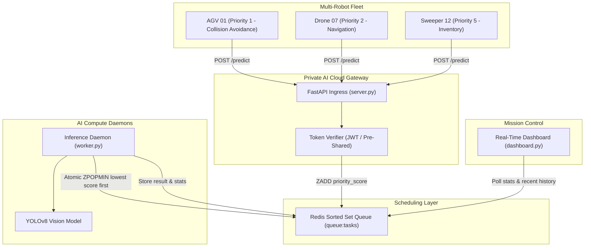

# 🤖 Private AI Cloud for Robotics (Edge-Cloud Microservices)

An ultra-low-latency, resilient, on-premise private AI computing infrastructure engineered for multi-robot fleets (AGVs, Drones, Mobile Robots).


---

## 📌 Key Objectives & Innovations

1. **Secure Ingress Gateway**: Token-authenticated HTTP endpoints (Bearer JWT & Pre-Shared Robot Token headers).
2. **Strict Priority Queue Scheduling**: Powered by atomic Redis Sorted Sets (`ZADD` / `ZPOPMIN`). Safety-critical operations like **AGV Collision Avoidance (Priority 1)** preempt standard jobs like **Drone Navigation (Priority 2)** and **Sweeper Telemetry (Priority 5)**.
3. **Sub-30ms Inference Latency**: In-memory byte streaming without intermediate disk I/O.
4. **Fault Tolerance & Network Drop Handling**: Client-side exponential backoff retry mechanism (1s, 2s, 4s, 8s...) and worker crash recovery.
5. **Live Mission Control Telemetry**: Real-time Streamlit dashboard auto-updating at 500ms intervals.

---

## 🏛️ System Architecture



---

## 📂 Repository Structure

- **`server.py`**: FastAPI gateway with token authentication, priority queue injection, and `/result/{task_id}` polling.
- **`worker.py`**: Continuous inference daemon with atomic `ZPOPMIN` transactions and bounding box extraction.
- **`robot_simulator.py`**: Multi-threaded mock robot client with exponential backoff and jitter.
- **`dashboard.py`**: Streamlit mission control dashboard showing live queue depth, latency, and telemetry table.
- **`run_all.bat`**: One-click local deployment script for Windows.
- **`requirements.txt`**: Minimal, production-tested dependency specifications.

---

## 🚀 Quick Start Guide

### 1. Clone & Navigate
```bash
git clone https://github.com/Tam1l/YHACK26_YS417_THE-REAL-BEGINNERS.git
cd YHACK26_YS417_THE-REAL-BEGINNERS
```

### 2. Launch Everything (Windows)
Run the bundled deployment script:
```cmd
run_all.bat
```

### 3. Manual Start (Linux / Mac / Windows)
```bash
# 1. Start Redis
redis-server

# 2. Virtual environment
python -m venv venv
source venv/bin/activate  # Or .\venv\Scripts\activate on Windows
pip install -r requirements.txt

# 3. Start API Gateway
uvicorn server:app --host 0.0.0.0 --port 8000

# 4. Start AI Worker Daemon (in a new terminal)
python worker.py

# 5. Start Telemetry Dashboard (in a new terminal)
streamlit run dashboard.py

# 6. Run Multi-Robot Stress Simulator (in a new terminal)
python robot_simulator.py
```

---

## 📡 API Reference

### 1. Ingest Task: `POST /predict`
- **Headers**: `X-Robot-Token: robot-token-secret` (or `Authorization: Bearer <token>`)
- **Body**:
```json
{
  "robot_id": "AGV-01",
  "priority": 1,
  "image_base64": "<base64_encoded_jpeg>"
}
```
- **Response** `(201 Created)`:
```json
{
  "task_id": "a04add1a-2228-4b00-8db7-d4c5a3ce3ea5",
  "robot_id": "AGV-01",
  "priority": 1,
  "state": "queued",
  "submitted_at": 1789039383.72
}
```

### 2. Poll Result: `GET /result/{task_id}`
- **Response** `(200 OK)`:
```json
{
  "task_id": "a04add1a-2228-4b00-8db7-d4c5a3ce3ea5",
  "robot_id": "AGV-01",
  "priority": 1,
  "state": "completed",
  "result": {
    "boxes": [[56, 58, 95, 88]],
    "classes": ["obstacle"],
    "confidences": [0.89],
    "detection_count": 1,
    "inference_time_ms": 16.67
  }
}
```
