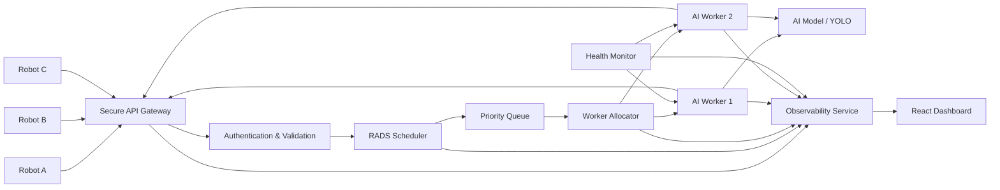
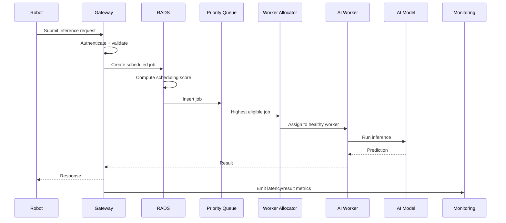
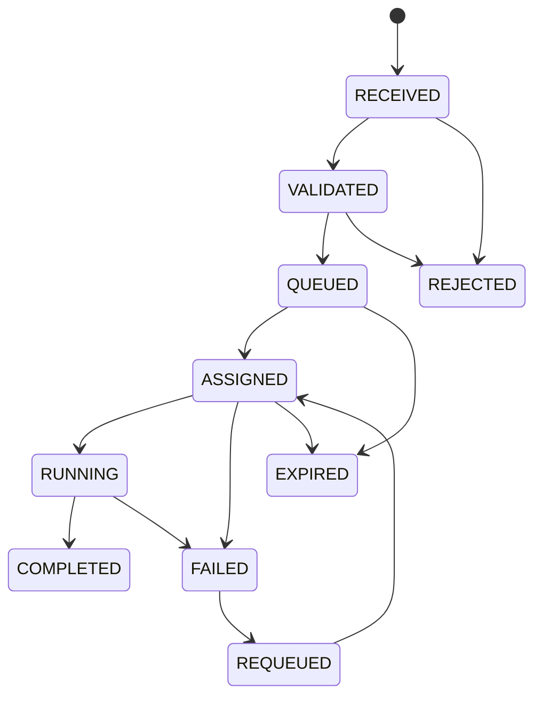
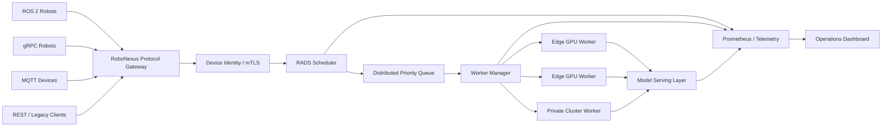

# RoboNexus — Comprehensive System Architecture & Implementation Specification

> **Document purpose:** This file is the implementation contract for Codex/engineering agents building RoboNexus end-to-end.
>
> **Project:** RoboNexus — Robotics-Aware Private AI Cloud  
> **Core innovation:** Robotics-aware orchestration of shared private AI compute using mission criticality, deadline urgency, waiting time, worker health, and failure-aware scheduling.  
> **Prototype goal:** Demonstrate that multiple robots can securely submit AI requests to a private local platform, have those requests intelligently scheduled, processed by shared AI workers, observed in real time, and recovered automatically from worker failures.
>
> **Important architectural truth:** RoboNexus is **not** “a YOLO server.” YOLO is only one AI workload. The product is the orchestration layer around AI inference.

---

# 1. Executive Summary

RoboNexus is a self-hosted private AI compute platform for robot fleets.

Instead of requiring every robot to carry expensive hardware capable of running heavy AI models, robots offload compute-intensive inference tasks to a nearby private AI cluster over a local network.

The platform must:

1. identify and authenticate robots;
2. receive AI inference requests;
3. attach robotics-specific execution context;
4. prioritize requests using the Robotics-Aware Deadline Scheduler (RADS);
5. assign work to healthy AI workers;
6. execute inference;
7. return results to the requesting robot;
8. continuously monitor latency, queue state, throughput, worker health, and failures;
9. recover automatically when a worker fails;
10. expose all important state through a dashboard.

The system should be demoable with simulated robots while remaining architecturally compatible with real robots.

---

# 2. The Problem We Are Solving

Robots increasingly require AI workloads such as:

- object detection;
- image classification;
- defect detection;
- semantic perception;
- speech processing;
- lightweight decision support.

Running every heavy model locally on every robot creates fleet-level issues:

- duplicated GPU/NPU hardware;
- increased robot cost;
- increased power consumption;
- increased thermal requirements;
- repeated model deployment and upgrades;
- poor utilization when individual robots are idle.

Moving all inference to a remote public cloud introduces different issues:

- WAN dependency;
- additional communication latency;
- internet availability dependency;
- sensitive industrial data leaving the facility;
- unpredictable network conditions.

RoboNexus addresses the middle ground:

**shared, private, nearby AI compute with robotics-aware scheduling and resilience.**

---

# 3. Architectural Positioning

RoboNexus is best understood as:

> **Private edge AI infrastructure + robotics-aware orchestration.**

It is not intended to replace:

- ROS 2;
- NVIDIA Triton;
- Kubernetes;
- AWS;
- robot operating systems;
- onboard hard real-time safety systems.

Instead, RoboNexus sits above or beside infrastructure and adds robot-aware policy.

## 3.1 What stays on the robot

The following should normally remain onboard:

- motor control;
- emergency stop;
- hard real-time control loops;
- minimum safe-stop capability;
- hardware safety interlocks;
- basic degraded-mode behavior.

## 3.2 What can be offloaded

RoboNexus is intended for heavier AI tasks such as:

- object detection;
- package recognition;
- visual inspection;
- defect detection;
- OCR;
- speech recognition;
- semantic classification;
- heavier perception;
- non-hard-real-time AI assistance.

---

# 4. System Architecture



---

# 5. Mental Model

The architecture should be explainable with five questions:

| Component | Question it answers |
|---|---|
| API Gateway | Who is requesting AI? |
| RADS | Which request should run next? |
| Worker Allocator | Where should it run? |
| AI Worker | Execute the AI task |
| Monitoring | Is the system healthy and meeting deadlines? |

---

# 6. High-Level Request Lifecycle



---

# 7. Technology Stack

## 7.1 MVP stack

### Backend
- Python 3.11+
- FastAPI
- Uvicorn
- Pydantic
- asyncio
- `heapq` or `asyncio.PriorityQueue`
- psutil
- WebSocket or server-sent events for live telemetry

### AI
- Ultralytics YOLO
- lightweight pretrained model
- CPU or GPU depending on available hardware

### Frontend
- React
- Vite
- Tailwind CSS
- Recharts or similar lightweight chart library

### Robot simulation
- Python scripts
- `httpx` or `requests`

### Optional packaging
- Docker
- Docker Compose

## 7.2 Production-oriented evolution

Potential production interfaces:

- gRPC for latency-sensitive inference;
- MQTT for telemetry;
- ROS 2 / DDS adapter;
- HTTPS REST for compatibility;
- mTLS/device certificates;
- Redis/NATS/RabbitMQ for distributed queues;
- containerized workers;
- NVIDIA Triton as model-serving layer;
- Prometheus/Grafana;
- Kubernetes or equivalent orchestration.

These are **not required for the hackathon MVP**.

---

# 8. Repository Structure

Recommended structure:

```text
robonexus/
│
├── backend/
│   ├── app/
│   │   ├── main.py
│   │   ├── config.py
│   │   ├── dependencies.py
│   │   │
│   │   ├── api/
│   │   │   ├── routes_health.py
│   │   │   ├── routes_robots.py
│   │   │   ├── routes_inference.py
│   │   │   ├── routes_metrics.py
│   │   │   └── websocket.py
│   │   │
│   │   ├── auth/
│   │   │   ├── api_keys.py
│   │   │   └── permissions.py
│   │   │
│   │   ├── scheduler/
│   │   │   ├── rads.py
│   │   │   ├── priority_queue.py
│   │   │   └── aging.py
│   │   │
│   │   ├── workers/
│   │   │   ├── manager.py
│   │   │   ├── worker.py
│   │   │   ├── health.py
│   │   │   └── registry.py
│   │   │
│   │   ├── inference/
│   │   │   ├── engine.py
│   │   │   ├── yolo_engine.py
│   │   │   └── simulated_engine.py
│   │   │
│   │   ├── observability/
│   │   │   ├── metrics.py
│   │   │   ├── events.py
│   │   │   └── telemetry.py
│   │   │
│   │   ├── schemas/
│   │   │   ├── robot.py
│   │   │   ├── request.py
│   │   │   ├── result.py
│   │   │   ├── worker.py
│   │   │   └── metrics.py
│   │   │
│   │   └── core/
│   │       ├── enums.py
│   │       ├── ids.py
│   │       └── clock.py
│   │
│   ├── tests/
│   │   ├── unit/
│   │   ├── integration/
│   │   └── load/
│   │
│   └── requirements.txt
│
├── frontend/
│   ├── src/
│   │   ├── pages/
│   │   ├── components/
│   │   ├── hooks/
│   │   ├── api/
│   │   └── types/
│   └── package.json
│
├── robots/
│   ├── simulator.py
│   ├── scenarios.py
│   └── sample_images/
│
├── scripts/
│   ├── run_demo.py
│   ├── run_fifo_benchmark.py
│   └── run_rads_benchmark.py
│
├── docker-compose.yml
├── .env.example
├── README.md
└── architecture.md
```

---

# 9. Core Domain Concepts

## 9.1 Robot

A robot is an authenticated client capable of requesting AI inference.

Each robot has:

- `robot_id`;
- `name`;
- `robot_type`;
- `api_key` or token;
- allowed task types;
- maximum allowed criticality;
- status;
- last-seen timestamp.

Example:

```json
{
  "robot_id": "AMR_07",
  "name": "Warehouse AMR 07",
  "robot_type": "AMR",
  "allowed_tasks": ["object_detection"],
  "max_criticality": "CRITICAL"
}
```

---

# 10. Inference Request Model

Every AI request must carry operational context.

Required fields:

```json
{
  "robot_id": "AMR_07",
  "task_type": "object_detection",
  "criticality": "CRITICAL",
  "deadline_ms": 150,
  "payload_type": "image",
  "submitted_at": "2026-09-10T12:00:00Z"
}
```

The actual image can be:

- multipart upload;
- binary request;
- encoded payload for prototype simplicity.

## 10.1 Criticality enum

```text
LOW
NORMAL
HIGH
CRITICAL
```

Recommended numeric mapping:

```text
LOW      = 1
NORMAL   = 2
HIGH     = 3
CRITICAL = 4
```

---

# 11. Request State Machine

Each inference request must have a clearly trackable state.



Allowed states:

- RECEIVED
- VALIDATED
- QUEUED
- ASSIGNED
- RUNNING
- COMPLETED
- FAILED
- REQUEUED
- EXPIRED
- REJECTED

---

# 12. RADS — Robotics-Aware Deadline Scheduler

RADS is the main scheduling innovation.

Its job:

> Decide **which request should execute next** when multiple robots are competing for limited AI compute.

RADS is not required to be machine learning.

It is a deterministic scheduling policy.

---

# 13. RADS Inputs

RADS should consider:

## Mission criticality
How serious is the physical consequence of delaying the request?

## Deadline urgency
How much time remains before the requested result becomes late?

## Waiting time
How long has the request already remained in the queue?

## Estimated inference cost
How expensive is this job likely to be?

Possible future inputs:

- robot state;
- battery;
- model size;
- predicted worker completion time;
- network quality;
- SLA class.

---

# 14. RADS Score

Conceptual scoring formula:

```text
score =
    Wc * criticality_score
  + Wd * deadline_urgency
  + Ww * waiting_score
  - Wi * inference_cost
```

Recommended prototype weights:

```text
Wc = 0.45
Wd = 0.35
Ww = 0.20
Wi = 0.10
```

These values should be configurable.

Do not hard-code them into business logic.

---

# 15. Deadline Urgency

For a request:

```text
deadline_at = created_at + deadline_ms
remaining_ms = deadline_at - now
```

Urgency should increase as `remaining_ms` approaches zero.

Possible normalized formulation:

```text
deadline_urgency =
    clamp(
        1 - (remaining_ms / original_deadline_ms),
        0,
        1
    )
```

If already late:

```text
remaining_ms <= 0
```

the request should be flagged as:

```text
deadline_missed = true
```

The request may still execute unless configured otherwise.

---

# 16. Aging / Starvation Prevention

A criticality-based scheduler can starve low-priority work.

RADS must therefore include aging.

Example:

```text
waiting_score = min(waiting_ms / AGING_WINDOW_MS, 1.0)
```

This means requests gradually become more competitive the longer they wait.

Definition:

> No valid request should remain permanently blocked only because higher-priority work continues arriving.

---

# 17. Priority Queue

The scheduler needs an ordered structure.

Recommended approach:

```python
(priority_key, sequence_number, job)
```

Because Python priority queues return the smallest value first, use:

```text
priority_key = -rads_score
```

The sequence number provides stable FIFO ordering when scores are equal.

---

# 18. Dynamic Recalculation

Because waiting time and deadline urgency change while a job is queued, RADS should not assume the initial score remains valid forever.

MVP options:

### Option A — recompute when selecting next job
Preferred for a small queue.

### Option B — periodically rebuild the queue
Useful if priority must visibly change.

### Option C — bucketed priority classes
Simpler fallback for hackathon reliability.

Recommended MVP:

> Store queued jobs normally, recompute candidate scores before dispatch.

Correctness is more important than implementing an overly clever heap algorithm.

---

# 19. Worker Allocator

RADS answers:

> Which job should run?

Worker Allocator answers:

> Which healthy worker should execute it?

This separation must remain explicit in code.

Do not merge scheduling and worker selection into one large function.

---

# 20. AI Worker Model

An AI Worker is a compute execution unit.

In the MVP, a worker can be:

- an asyncio task;
- a Python process;
- a thread;
- a local worker service.

In production, it may map to:

- GPU process;
- container;
- edge server;
- GPU node.

Worker properties:

```json
{
  "worker_id": "worker-2",
  "status": "IDLE",
  "healthy": true,
  "current_job_id": null,
  "processed_jobs": 17,
  "last_heartbeat": "..."
}
```

---

# 21. Worker States

```text
STARTING
IDLE
BUSY
UNHEALTHY
OFFLINE
```

Only healthy IDLE workers should normally receive new jobs.

---

# 22. Worker Selection Strategy

For MVP:

1. filter healthy workers;
2. prefer IDLE workers;
3. if more than one is idle, choose least recently used or lowest processed count;
4. assign selected job.

Future:

```text
worker_score =
    load
  + queue_depth
  + predicted_inference_time
  + network_cost
```

---

# 23. AI Inference Layer

The inference layer must be abstracted.

Define an interface such as:

```python
class InferenceEngine:
    async def infer(self, job) -> InferenceResult:
        ...
```

Implement at least:

```text
SimulatedInferenceEngine
YoloInferenceEngine
```

Why?

Because the scheduling system must be testable without depending on YOLO.

---

# 24. Simulated Inference Engine

This is essential for predictable scheduler testing.

Example behavior:

```python
await asyncio.sleep(job.simulated_runtime_ms / 1000)
```

It should return deterministic output such as:

```json
{
  "status": "success",
  "model": "simulated",
  "processing_ms": 500
}
```

Use it first to validate:

- queue order;
- concurrency;
- priority;
- failover;
- timing metrics.

---

# 25. YOLO Inference Engine

After the scheduling pipeline works, integrate YOLO.

Responsibilities:

1. load model once on worker startup;
2. avoid loading model for every request;
3. receive image;
4. run inference;
5. normalize detections;
6. return structured results;
7. record inference time.

Example result:

```json
{
  "request_id": "req_123",
  "task_type": "object_detection",
  "detections": [
    {
      "class": "person",
      "confidence": 0.94,
      "bbox": [120, 80, 320, 480]
    }
  ],
  "inference_ms": 44
}
```

---

# 26. API Gateway

FastAPI is the MVP gateway.

Responsibilities:

- expose HTTP endpoints;
- validate payloads;
- authenticate robot;
- generate request ID;
- attach server-side timestamps;
- reject invalid requests;
- forward jobs to scheduler;
- return asynchronous job state/results;
- expose health and metrics.

---

# 27. MVP API Contract

## Health

```http
GET /health
```

Response:

```json
{
  "status": "ok",
  "workers_healthy": 2,
  "workers_total": 2
}
```

---

## Register Robot

```http
POST /api/v1/robots/register
```

For hackathon convenience.

Request:

```json
{
  "name": "AMR 01",
  "robot_type": "AMR"
}
```

Response:

```json
{
  "robot_id": "AMR_01",
  "api_key": "generated-secret"
}
```

Production registration should be administrator-controlled.

---

## List Robots

```http
GET /api/v1/robots
```

---

## Submit inference request

```http
POST /api/v1/inference
```

Headers:

```text
X-Robot-ID: AMR_01
X-API-Key: ...
```

Multipart fields:

```text
task_type
criticality
deadline_ms
image
```

Response:

```json
{
  "request_id": "req_...",
  "status": "QUEUED"
}
```

---

## Request status

```http
GET /api/v1/inference/{request_id}
```

---

## Request result

```http
GET /api/v1/inference/{request_id}/result
```

Response:

```json
{
  "request_id": "...",
  "status": "COMPLETED",
  "queue_wait_ms": 27,
  "inference_ms": 51,
  "total_latency_ms": 84,
  "deadline_met": true,
  "result": {}
}
```

---

## Metrics

```http
GET /api/v1/metrics
```

---

## Workers

```http
GET /api/v1/workers
```

---

## WebSocket

```text
/ws/telemetry
```

Broadcast:

- job created;
- job scheduled;
- job assigned;
- job completed;
- job failed;
- worker online;
- worker offline;
- deadline missed;
- queue depth changes.

---

# 28. Authentication

MVP:

- robot ID;
- API key;
- API key lookup;
- constant-time comparison where practical;
- reject missing/invalid credentials.

Production:

- mTLS;
- device certificates;
- rotated credentials;
- hardware-backed keys;
- RBAC.

---

# 29. Authorization

Authentication answers:

> Who are you?

Authorization answers:

> What are you allowed to request?

This matters because a malicious robot must not be able to self-declare unlimited critical priority.

Robot policy example:

```json
{
  "robot_id": "inventory_bot_1",
  "allowed_tasks": ["barcode", "classification"],
  "max_criticality": "NORMAL"
}
```

If it sends:

```text
criticality = CRITICAL
```

RoboNexus should reject or clamp it.

---

# 30. Priority Policy

Recommended production-inspired policy:

```text
P0 / CRITICAL
P1 / HIGH
P2 / NORMAL
P3 / LOW
```

Examples:

```text
CRITICAL:
human proximity
urgent safety perception

HIGH:
navigation perception
mission blocking inspection

NORMAL:
routine object detection

LOW:
inventory analytics
background classification
```

The platform should store policy server-side where possible.

---

# 31. Fault Tolerance

Fault tolerance is mandatory to the product story.

Minimum MVP failure scenario:

> A worker dies while executing a job.

System behavior:

1. heartbeat timeout occurs;
2. worker marked UNHEALTHY;
3. current job identified;
4. job state set to FAILED/REQUEUED;
5. retry count incremented;
6. original criticality and deadline preserved;
7. job returned to scheduler;
8. another healthy worker receives the job;
9. failure and recovery metrics emitted.

---

# 32. Heartbeat

Each worker must emit or update a heartbeat.

Recommended interval:

```text
1–2 seconds for demo
```

Worker is unhealthy after:

```text
3 missed intervals
```

Keep values configurable.

---

# 33. Retry Policy

Fields:

```text
retry_count
max_retries
last_error
```

Recommended:

```text
max_retries = 2
```

Do not create infinite retry loops.

If all retries fail:

```text
status = FAILED
```

---

# 34. Criticality-Preserving Failover

A critical request must not become low priority after failure.

Preserve:

- original criticality;
- original deadline;
- original creation timestamp;
- waiting age;
- request ID.

This is a key product differentiator.

---

# 35. Deadline Miss Handling

If a job exceeds its deadline:

1. set `deadline_met = false`;
2. increment deadline miss metrics;
3. emit telemetry event;
4. optionally continue inference;
5. expose miss visibly in dashboard.

Do not silently discard the event.

---

# 36. Predictive Deadline Risk

Advanced feature.

Before assigning:

```text
estimated_completion =
    current_time
  + estimated_queue_delay
  + estimated_inference_time
```

If:

```text
estimated_completion > deadline_at
```

mark:

```text
deadline_risk = HIGH
```

Possible actions:

- increase priority;
- choose faster worker;
- choose lighter model;
- alert dashboard.

For hackathon:

Implement the **risk flag** first.

Adaptive action is optional.

---

# 37. Adaptive Model Selection

Optional/advanced.

Concept:

```text
Normal request + relaxed deadline
→ more accurate model

Urgent request + tight deadline
→ lightweight model
```

Do not make this a core dependency.

Only implement after:

- scheduler;
- failover;
- dashboard;
- benchmark

are stable.

---

# 38. Local Degraded Mode

Production architecture should assume private cloud may also fail.

Therefore:

- emergency stop stays onboard;
- minimum safe behavior stays onboard;
- cloud failure should not cause unsafe actuation.

RoboNexus should never claim to replace hard real-time safety controllers.

For MVP:

Display this as architectural policy.

Actual onboard fallback is not required.

---

# 39. Observability

RoboNexus must prove its value through metrics.

The observability service should record:

## System metrics
- queue depth;
- active requests;
- completed requests;
- failed requests;
- requests/sec;
- total workers;
- healthy workers;
- CPU;
- RAM;
- GPU if available.

## Latency metrics
- queue wait;
- inference time;
- end-to-end latency;
- p50;
- p95.

## Robotics metrics
- requests per robot;
- criticality distribution;
- deadline success;
- deadline misses.

## Reliability metrics
- worker failures;
- failovers;
- failover recovery time;
- retry count.

---

# 40. Core Metric — Critical Deadline Satisfaction Rate

Define:

```text
CDSR =
    critical requests completed before deadline
    --------------------------------------------
    total completed critical requests
```

Multiply by 100 for percentage.

This should be one of the most visible demo metrics.

---

# 41. FIFO vs RADS Benchmark

This benchmark is essential.

Use the exact same workload.

Scenario:

```text
2 workers
50 normal requests
10 critical requests
mixed deadlines
same simulated runtimes
```

Run once with:

```text
FIFO
```

Run once with:

```text
RADS
```

Compare:

- critical p50 latency;
- critical p95 latency;
- critical deadline satisfaction;
- average normal latency;
- throughput;
- queue wait.

The expected product story:

> RADS may accept slightly higher non-critical latency in exchange for significantly better critical deadline satisfaction under contention.

Never fabricate benchmark numbers.

---

# 42. Dashboard

The dashboard is part of the product, not decoration.

Recommended pages:

## Overview
Show:
- connected robots;
- workers;
- queue depth;
- throughput;
- p95 latency;
- critical deadline satisfaction.

## Live Requests
Table columns:
- request ID;
- robot;
- task;
- criticality;
- deadline;
- state;
- queue wait;
- assigned worker;
- deadline status.

## Workers
Cards:
- worker ID;
- health;
- busy/idle;
- current job;
- jobs completed;
- last heartbeat;
- average inference time.

## Robots
Cards/table:
- robot ID;
- robot type;
- connected status;
- last seen;
- request count;
- current request.

## Performance
Charts:
- request latency over time;
- queue depth over time;
- throughput;
- FIFO vs RADS;
- deadline success.

## Events
Timeline:
- worker failure;
- requeue;
- deadline miss;
- critical request;
- recovery.

---

# 43. Frontend Data Strategy

Use one of:

### Preferred
WebSocket live event stream.

### Simpler fallback
Poll `/api/v1/metrics` and `/api/v1/requests` every second.

Do not block the project on WebSocket implementation if polling is more reliable.

---

# 44. Robot Simulator

The simulator must create convincing multi-robot traffic.

Simulated robots:

```text
inventory_bot
inspection_bot
safety_amr
```

Each must have different behavior.

Example:

### Inventory Bot
- LOW/NORMAL priority
- relaxed deadlines
- steady request rate

### Inspection Bot
- HIGH
- medium deadlines
- bursty traffic

### Safety AMR
- CRITICAL
- short deadlines
- occasional requests

---

# 45. Demo Scenario

The primary demo should be deterministic.

## Step 1
Start:

```text
3 robots
2 workers
dashboard
```

## Step 2
Generate many NORMAL/LOW requests.

Queue visibly grows.

## Step 3
Send one CRITICAL request.

Expected:

```text
critical request jumps ahead
```

## Step 4
Show completion before less-important queued work.

## Step 5
Force one worker to fail.

Expected:

```text
worker turns red
job is requeued
healthy worker takes over
```

## Step 6
Show metrics:

- critical request latency;
- deadline status;
- failover event;
- queue depth;
- worker health.

## Step 7
Show FIFO vs RADS chart or benchmark result.

Stop.

Do not overload the live demo with unrelated features.

---

# 46. Manual Failure Injection

Provide a development/demo endpoint only:

```http
POST /api/v1/debug/workers/{worker_id}/fail
```

or a CLI:

```bash
python scripts/fail_worker.py worker-1
```

Must be disabled outside development mode.

---

# 47. End-to-End Latency Model

Define:

```text
L_total =
    L_network
  + L_gateway
  + L_queue
  + L_inference
  + L_response
```

Record at minimum:

- request received timestamp;
- queued timestamp;
- assigned timestamp;
- inference start;
- inference end;
- response ready.

Derived:

```text
queue_wait_ms
inference_ms
total_latency_ms
```

---

# 48. Latency Positioning

Do not claim:

> RoboNexus is always faster than onboard AI.

Correct positioning:

- hard real-time safety remains onboard;
- robots with powerful local accelerators may have faster local inference;
- RoboNexus targets resource-constrained fleets;
- nearby pooled compute avoids mandatory WAN round trips;
- RADS specifically reduces queueing latency for important requests under contention.

---

# 49. Security Requirements

MVP minimum:

- no unauthenticated inference endpoint;
- unique credentials per robot;
- validate file type;
- validate upload size;
- validate deadline range;
- validate criticality enum;
- never trust client timestamp for authoritative timing;
- reject unknown robot;
- server controls maximum criticality;
- sanitize logs;
- do not log API keys.

---

# 50. Input Validation

Recommended limits:

```text
deadline_ms:
minimum 10
maximum 30000

image:
maximum 10 MB

criticality:
known enum only

task_type:
registered task only
```

Return clear HTTP 4xx responses.

---

# 51. Error Response Format

Standardize:

```json
{
  "error": {
    "code": "INVALID_CRITICALITY",
    "message": "Requested criticality exceeds robot policy",
    "request_id": "..."
  }
}
```

---

# 52. Persistence

For hackathon MVP, full persistence is optional.

Safe choice:

- in-memory request store;
- in-memory worker registry;
- in-memory metrics;
- optional JSON event export.

If persistence is needed:

- SQLite first.

Do not add PostgreSQL unless there is a concrete need.

---

# 53. Configuration

All runtime settings belong in environment/config.

Example:

```env
ROBONEXUS_ENV=development
API_HOST=0.0.0.0
API_PORT=8000

RADS_WEIGHT_CRITICALITY=0.45
RADS_WEIGHT_DEADLINE=0.35
RADS_WEIGHT_WAITING=0.20
RADS_WEIGHT_INFERENCE=0.10

WORKER_COUNT=2
WORKER_HEARTBEAT_INTERVAL_MS=1000
WORKER_HEARTBEAT_TIMEOUT_MS=3000
MAX_RETRIES=2

INFERENCE_ENGINE=simulated
YOLO_MODEL=yolo11n.pt
```

---

# 54. Logging

Every important event must be structured.

Example:

```json
{
  "event": "job_assigned",
  "request_id": "req_123",
  "robot_id": "AMR_07",
  "worker_id": "worker-2",
  "criticality": "CRITICAL",
  "deadline_remaining_ms": 92,
  "rads_score": 0.91
}
```

---

# 55. Events

Recommended event types:

```text
ROBOT_REGISTERED
ROBOT_AUTH_FAILED
REQUEST_RECEIVED
REQUEST_VALIDATED
REQUEST_REJECTED
REQUEST_QUEUED
REQUEST_PRIORITY_UPDATED
REQUEST_ASSIGNED
INFERENCE_STARTED
INFERENCE_COMPLETED
REQUEST_DEADLINE_MISSED
WORKER_STARTED
WORKER_HEARTBEAT
WORKER_FAILED
REQUEST_REQUEUED
FAILOVER_COMPLETED
```

---

# 56. Testing Strategy

The project is not done because the UI loads.

Tests must cover the orchestration logic.

---

# 57. Unit Tests

## RADS
Test:

- critical request outranks low request under equivalent conditions;
- urgent deadline can outrank less-urgent work;
- aging raises score;
- inference cost penalty is applied;
- score remains deterministic.

## Authentication
Test:

- valid robot accepted;
- invalid key rejected;
- unknown robot rejected;
- unauthorized criticality rejected.

## Request validation
Test:

- invalid deadline;
- invalid task;
- oversized payload;
- malformed request.

---

# 58. Scheduler Integration Tests

Test:

### Test A
Queue:

```text
LOW
NORMAL
CRITICAL
```

Expected:

```text
CRITICAL
NORMAL
LOW
```

assuming deadlines are equivalent.

### Test B
Long-waiting low job should eventually improve priority.

### Test C
Very urgent HIGH may beat relaxed CRITICAL depending on configured score.

---

# 59. Worker Tests

Test:

- worker starts;
- heartbeat updates;
- worker receives job;
- worker becomes BUSY;
- worker completes job;
- worker returns IDLE;
- unhealthy worker receives no new jobs.

---

# 60. Failover Integration Test

Scenario:

1. submit CRITICAL job;
2. assign worker-1;
3. fail worker-1;
4. health monitor marks unhealthy;
5. job requeued;
6. worker-2 receives same request;
7. criticality unchanged;
8. retry count increments;
9. telemetry records failover.

This test is mandatory.

---

# 61. Concurrency Test

Run multiple simulator clients concurrently.

Minimum:

```text
3 robots
20+ requests
2 workers
```

Verify:

- no duplicate request IDs;
- no job processed twice under normal conditions;
- no queue corruption;
- responses map to correct robot;
- worker state remains consistent.

---

# 62. Benchmark Test

Provide scripts:

```bash
python scripts/run_fifo_benchmark.py
python scripts/run_rads_benchmark.py
```

Output JSON/CSV:

```json
{
  "scheduler": "RADS",
  "total_requests": 60,
  "critical_requests": 10,
  "critical_p50_ms": 0,
  "critical_p95_ms": 0,
  "critical_deadline_success_pct": 0,
  "overall_throughput_rps": 0
}
```

Values must come from actual execution.

---

# 63. Performance Acceptance

Prototype performance depends on machine hardware, so absolute latency should not be hard-coded as a universal pass/fail criterion.

Instead, benchmark success is:

> Under controlled contention, RADS demonstrates materially better critical-request deadline satisfaction and/or critical-request queue latency than FIFO without system instability.

---

# 64. Build Order

Agents must implement in this order.

---

# Phase 0 — Repository Bootstrap

Tasks:

- create directory structure;
- backend environment;
- frontend environment;
- `.env.example`;
- root README;
- health endpoint;
- basic frontend connectivity.

### Definition of Done

- backend starts with one command;
- frontend starts with one command;
- frontend can successfully read backend `/health`;
- clean clone instructions exist;
- no secret committed.

---

# Phase 1 — Domain Models

Implement:

- Robot;
- InferenceRequest;
- ScheduledJob;
- InferenceResult;
- WorkerState;
- enums.

### Definition of Done

- all schemas validated by Pydantic;
- invalid criticality rejected;
- request IDs generated server-side;
- timestamps generated server-side;
- unit tests pass.

---

# Phase 2 — Robot Registry & Authentication

Implement:

- robot registration;
- credential generation;
- API key verification;
- robot policy;
- task authorization.

### Definition of Done

- authenticated robot can submit;
- invalid API key returns 401;
- unknown robot returns 401/403;
- robot cannot exceed configured criticality;
- API keys never appear in normal logs.

---

# Phase 3 — Request Gateway

Implement:

- inference submission;
- image validation;
- request tracking;
- request status endpoint.

### Definition of Done

- authenticated request produces request ID;
- request enters QUEUED state;
- malformed requests receive useful 4xx response;
- request can be queried by ID.

---

# Phase 4 — Simulated Inference Engine

Implement deterministic simulated inference.

### Definition of Done

- worker can execute simulated jobs;
- runtime can be configured;
- output contains timing;
- no YOLO dependency required for scheduler tests.

---

# Phase 5 — Worker Pool

Implement:

- worker registry;
- N workers;
- IDLE/BUSY transitions;
- job execution;
- completion callback.

### Definition of Done

- at least two workers operate concurrently;
- worker does not receive second job while BUSY;
- completed worker returns IDLE;
- metrics record worker and execution time.

---

# Phase 6 — FIFO Baseline

Implement simple FIFO scheduler first.

### Definition of Done

- concurrent incoming requests are queued;
- execution order is reproducible;
- FIFO benchmark runs successfully;
- results can be exported.

Why first?

Because RADS must be compared against a baseline.

---

# Phase 7 — RADS

Implement:

- criticality scoring;
- deadline urgency;
- waiting-time aging;
- estimated inference cost;
- score calculation;
- priority selection.

### Definition of Done

- RADS score visible in logs/API;
- critical jobs normally outrank low jobs;
- urgent deadline affects ordering;
- aging affects waiting jobs;
- unit tests prove expected order;
- scheduler strategy can be switched between FIFO and RADS by config.

---

# Phase 8 — Worker Allocator

Implement health-aware assignment.

### Definition of Done

- only healthy workers selected;
- idle worker receives job;
- assignment event emitted;
- worker ID stored on request;
- allocation logic separate from RADS.

---

# Phase 9 — YOLO Integration

Implement real inference.

### Definition of Done

- model loads once;
- image request successfully processed;
- detections returned;
- inference timing recorded;
- scheduler continues to work;
- simulated engine still available.

---

# Phase 10 — Health Monitoring

Implement:

- heartbeat;
- last heartbeat timestamp;
- timeout;
- worker health state.

### Definition of Done

- active workers appear healthy;
- killed worker becomes unhealthy automatically;
- unhealthy worker receives no new jobs;
- event emitted.

---

# Phase 11 — Failover

Implement:

- detect in-flight job on worker failure;
- requeue;
- retry limit;
- preserve criticality/deadline.

### Definition of Done

- live job survives a forced worker failure;
- same request ID is recovered;
- another worker executes it;
- retry count is correct;
- failover event visible;
- no infinite retry.

---

# Phase 12 — Metrics

Implement aggregated metrics.

### Definition of Done

Expose:

- request count;
- queue depth;
- healthy workers;
- throughput;
- queue latency;
- inference latency;
- total latency;
- deadline success;
- critical deadline success;
- failures;
- failovers.

---

# Phase 13 — Dashboard

Implement full observability UI.

### Definition of Done

Dashboard visibly shows:

- robots;
- workers;
- queue;
- active jobs;
- criticality;
- deadlines;
- latency;
- worker health;
- failover events;
- deadline status.

Data updates live or at least every second.

---

# Phase 14 — Robot Simulator

Implement deterministic scenarios.

### Definition of Done

One command launches:

- inventory robot;
- inspection robot;
- safety robot.

The simulator must generate mixed workloads and a recognizable critical event.

---

# Phase 15 — FIFO vs RADS Evaluation

### Definition of Done

- same workload replayable under FIFO;
- same workload replayable under RADS;
- result files generated;
- critical latency/deadline metrics compared;
- dashboard or chart can show comparison.

---

# Phase 16 — Security Hardening

Implement:

- payload limits;
- allowed task enforcement;
- key redaction;
- server-side criticality cap;
- debug endpoint protection;
- CORS configuration.

### Definition of Done

Basic abuse cases fail safely.

---

# Phase 17 — Dockerization

Only after system works locally.

### Definition of Done

```bash
docker compose up
```

starts required services without manual code changes.

Do not let Docker delay core implementation.

---

# 65. Definition of Done — Entire MVP

The project is **DONE** only when all of the following are true.

## Core infrastructure
- FastAPI backend runs;
- React dashboard runs;
- at least 3 simulated robots can connect;
- at least 2 AI workers exist.

## Authentication
- each robot is identifiable;
- invalid credentials are rejected;
- criticality policy exists.

## Scheduling
- FIFO baseline exists;
- RADS exists;
- RADS uses criticality;
- RADS uses deadline urgency;
- RADS uses waiting time;
- scheduler strategy is configurable.

## AI
- at least one actual pretrained AI model executes;
- YOLO result is returned;
- model load is persistent.

## Concurrency
- multiple robots can submit concurrently;
- workers process jobs concurrently.

## Reliability
- worker heartbeat exists;
- worker failure is detected;
- failed in-flight job is requeued;
- another worker can complete it;
- retry count is bounded.

## Observability
- queue depth visible;
- workers visible;
- request states visible;
- queue wait visible;
- inference latency visible;
- total latency visible;
- deadline status visible;
- failover visible.

## Evaluation
- FIFO benchmark exists;
- RADS benchmark exists;
- both use the same workload;
- actual metrics generated;
- critical deadline success compared.

## Demo
The team can demonstrate:

```text
normal traffic
→ queue builds
→ critical request arrives
→ RADS prioritizes it
→ AI inference completes
→ worker failure injected
→ request recovered
→ dashboard shows everything
```

If the above flow works live, the core hackathon objective is complete.

---

# 66. Non-Goals for MVP

Do **not** spend hackathon time on:

- Kubernetes cluster;
- full ROS 2 implementation;
- physical robot integration;
- custom model training;
- distributed database;
- complex service mesh;
- production PKI;
- real GPU scheduling;
- multi-region HA;
- hard real-time guarantees;
- reinforcement-learning scheduler;
- advanced autoscaling;
- every AI modality;
- complete hybrid cloud.

These are roadmap items.

---

# 67. Stretch Goals

Only after MVP is stable.

Priority order:

1. predictive deadline risk;
2. model selection based on deadline;
3. gRPC interface;
4. ROS 2 adapter;
5. MQTT telemetry;
6. Prometheus;
7. GPU metrics;
8. Docker Compose;
9. distributed workers;
10. hybrid edge-cloud routing.

---

# 68. Production Architecture



---

# 69. Production Communication Strategy

RoboNexus should be protocol-agnostic at the gateway.

Recommended:

## gRPC
For:
- request/response inference;
- low-overhead binary payloads;
- persistent connections;
- streaming;
- deadlines.

## ROS 2 / DDS
For:
- native robotics integration;
- topic-based sensor and result exchange.

## MQTT
For:
- robot telemetry;
- health;
- lightweight events;
- status.

## HTTPS REST
For:
- configuration;
- compatibility;
- administration;
- legacy clients.

The internal scheduler should not care which protocol produced the job.

Everything must normalize into the same `InferenceRequest`.

---

# 70. Protocol Adapter Pattern

```text
REST Adapter ─┐
gRPC Adapter ─┤
ROS Adapter ──┼──> Normalized InferenceRequest
MQTT Adapter ─┘
                       ↓
                     RADS
```

This is critical for heterogeneous fleets.

---

# 71. Real Robot Integration

A real robot should not require total reprogramming.

The robot needs a lightweight RoboNexus adapter.

```text
Existing Robot
│
├─ motor control
├─ navigation
├─ sensors
├─ safety
└─ RoboNexus Client
      ↓
   inference request
      ↓
   RoboNexus
      ↓
   result
      ↓
 existing robot logic
```

---

# 72. ROS 2 Integration Concept

Production adapter:

```text
/camera/image
      ↓
RoboNexus ROS Node
      ↓
gRPC / internal API
      ↓
RoboNexus
      ↓
detection result
      ↓
/robonexus/detections
```

This allows existing ROS applications to consume RoboNexus output with minimal modification.

---

# 73. Public Cloud / Hybrid Extension

RoboNexus is currently private-first.

Future hybrid policy:

```text
critical + private + low deadline
→ local private compute

batch + low priority + relaxed deadline
→ optional remote cloud
```

Possible routing inputs:

```text
criticality
deadline
privacy
network state
cost
local load
```

This should remain optional.

---

# 74. Architectural Invariants

Agents must preserve these rules.

### Invariant 1
RADS decides request order.

### Invariant 2
Worker allocator decides placement.

### Invariant 3
AI engine only performs inference.

### Invariant 4
Gateway does not contain scheduling business logic.

### Invariant 5
Clients cannot grant themselves arbitrary priority.

### Invariant 6
Failed jobs preserve original mission context.

### Invariant 7
Hard real-time robot safety is not delegated to RoboNexus.

### Invariant 8
All latency claims must be measured end-to-end.

---

# 75. Engineering Trade-Offs

## Why not run everything onboard?

Because the target is resource-constrained fleets where duplicated accelerators are undesirable.

## Why not public cloud only?

Because the target values local control, privacy, nearby inference, and independence from WAN availability.

## Why not FIFO?

Because FIFO is unaware of physical mission consequences.

## Why not priority alone?

Because deadline urgency and starvation matter.

## Why not make RADS ML-based?

Because deterministic scheduling is easier to explain, verify, debug, and demo reliably in a 24-hour hackathon.

---

# 76. Jury-Defensible Innovation Statement

> RoboNexus transforms AI inference scheduling from a generic compute problem into a robotics-aware orchestration problem. Each inference request carries robot identity, mission criticality and deadline information. RADS uses that context to determine execution order, while a separate worker manager selects healthy compute resources and preserves request urgency across failures.

---

# 77. What Is Not Novel

Do not claim these individually as inventions:

- YOLO;
- FastAPI;
- REST;
- priority queues;
- worker pools;
- private clouds;
- health checks;
- dashboards;
- API keys.

The differentiation is in their **robotics-aware integration and orchestration policy**.

---

# 78. Demo Script for Engineering Agents

Agents should optimize the implementation for this final demo.

```text
1. Open dashboard.
2. Show 3 connected robots.
3. Show 2 healthy workers.
4. Start background NORMAL/LOW workload.
5. Queue begins growing.
6. Trigger CRITICAL safety request.
7. Highlight RADS score.
8. Show CRITICAL request move ahead.
9. Show YOLO inference result.
10. Force worker-1 failure.
11. Dashboard marks worker unhealthy.
12. In-flight request requeues.
13. Worker-2 completes it.
14. Show failover recovery time.
15. Open FIFO vs RADS comparison.
16. Highlight critical deadline satisfaction.
```

---

# 79. Codex Agent Execution Rules

Every coding agent must:

1. read this file before editing;
2. preserve component boundaries;
3. implement one phase at a time;
4. add tests with each feature;
5. never replace deterministic scheduler logic with undocumented heuristics;
6. never silently remove metrics;
7. never fabricate benchmark values;
8. keep all weights/config in configuration;
9. preserve simulated inference mode;
10. avoid adding unnecessary infrastructure.

---

# 80. Agent Task Template

Use this structure when assigning a Codex task:

```text
TASK:
Implement Phase X.

READ FIRST:
architecture.md

GOAL:
<specific feature>

FILES TO CREATE/MODIFY:
<files>

REQUIREMENTS:
<requirements>

DO NOT:
<non-goals>

TESTS:
<required tests>

DEFINITION OF DONE:
<copy DoD from architecture.md>

OUTPUT:
- changed files
- tests run
- pass/fail status
- unresolved issues
```

---

# 81. Recommended First Codex Prompt

```text
Read architecture.md completely before making any changes.

Implement RoboNexus Phase 0 through Phase 4 only.

Priorities:
1. backend structure;
2. Pydantic domain models;
3. robot registry and API-key authentication;
4. inference submission endpoint;
5. in-memory request tracking;
6. deterministic simulated inference engine;
7. health endpoint;
8. unit tests.

Do not implement YOLO, Docker, WebSockets, ROS, gRPC, or the React dashboard yet.

Preserve all architectural boundaries from architecture.md.

When complete:
- run tests;
- report changed files;
- report API endpoints;
- report anything incomplete.
```

---

# 82. Recommended Second Codex Prompt

```text
Read architecture.md completely.

Implement RoboNexus Phase 5 through Phase 8.

Required:
- two or more asynchronous workers;
- worker registry;
- FIFO scheduler baseline;
- RADS scheduler;
- configurable scheduler selection;
- criticality score;
- deadline urgency;
- waiting-time aging;
- inference-cost term;
- health-aware worker allocator;
- scheduler unit/integration tests.

Do not add YOLO yet.

Add a deterministic test proving:
- a CRITICAL request can overtake NORMAL backlog;
- aging improves waiting-job priority;
- urgent deadlines influence scheduling.

Run tests and report results.
```

---

# 83. Recommended Third Codex Prompt

```text
Read architecture.md completely.

Implement RoboNexus Phase 9 through Phase 13.

Required:
- YOLO inference engine;
- worker heartbeat;
- worker failure detection;
- in-flight job requeue;
- bounded retries;
- criticality-preserving failover;
- metrics aggregation;
- telemetry API;
- React dashboard.

Keep simulated inference available.

Add an explicit demo failure mechanism available only in development mode.

Definition of done:
- one YOLO request succeeds;
- worker failure is detected;
- affected request is reassigned;
- dashboard displays robots, workers, queue, request states, latency, deadlines, and failure events.
```

---

# 84. Recommended Fourth Codex Prompt

```text
Read architecture.md completely.

Implement RoboNexus Phase 14 through Phase 16.

Required:
- 3-robot simulator;
- deterministic workload scenarios;
- FIFO benchmark;
- RADS benchmark;
- identical workload replay;
- critical deadline satisfaction metric;
- p50/p95 latency calculations;
- benchmark export;
- frontend benchmark comparison view;
- validation and security hardening.

Do not fabricate metrics.

Run the complete demo flow and fix any reliability issues that prevent repeatable execution.
```

---

# 85. Final Acceptance Checklist

Before declaring RoboNexus complete, verify every box:

```text
[ ] Backend starts
[ ] Frontend starts
[ ] 3 simulated robots connect
[ ] 2 workers run
[ ] Robot authentication works
[ ] Invalid auth rejected
[ ] Inference request accepted
[ ] FIFO scheduler works
[ ] RADS works
[ ] Criticality affects order
[ ] Deadline affects order
[ ] Aging affects order
[ ] Worker allocator is separate
[ ] Simulated inference works
[ ] YOLO inference works
[ ] Request result returned
[ ] Worker heartbeat works
[ ] Worker failure detected
[ ] In-flight request requeued
[ ] Retry bounded
[ ] Criticality preserved
[ ] Queue metrics shown
[ ] Latency metrics shown
[ ] Deadline status shown
[ ] Worker health shown
[ ] Failover event shown
[ ] FIFO benchmark generated
[ ] RADS benchmark generated
[ ] Same workload used
[ ] Critical deadline success calculated
[ ] Demo script is repeatable
[ ] README contains run instructions
[ ] No secrets committed
```

---

# 86. Final Definition of Success

RoboNexus succeeds if the team can prove the following statement live:

> Multiple robots can securely share a private AI compute pool, and when resources are constrained, RoboNexus uses robotics-aware scheduling to prioritize the requests that matter most, executes them on healthy AI workers, and recovers critical work when a worker fails.

Everything else is secondary.

---

# 87. One-Line Architecture Summary

```text
Robots
→ Secure Gateway
→ RADS
→ Priority Queue
→ Healthy Worker Selection
→ AI Inference
→ Result
→ Metrics + Failover
```

---

# 88. Product Principle

> **The AI model answers the request. RoboNexus decides who gets AI compute, when they get it, where it runs, and how that request survives failure.**
