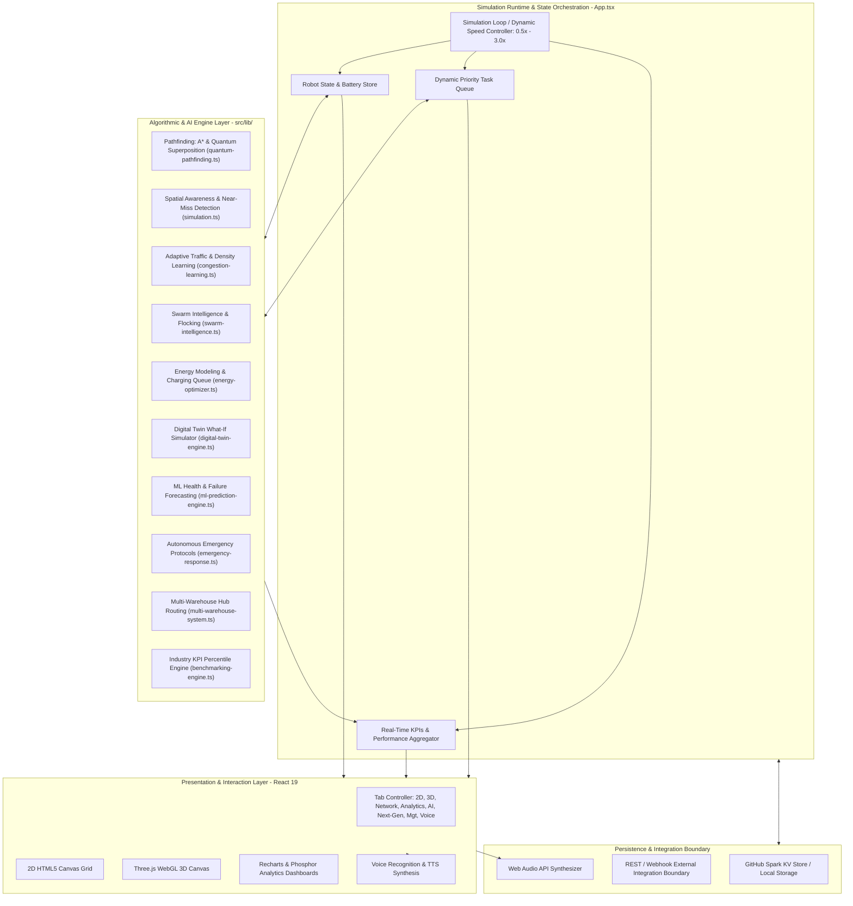

# 🏗️ Architecture Specification: Next-Gen Autonomous Warehouse Network (v3.0)

## 📌 Executive Summary

The **Next-Gen Autonomous Warehouse Network** (`software-first-robot`) is a high-performance, client-side autonomous robotics simulation platform and digital twin ground control station. Engineered in **React 19**, **TypeScript 5.7**, and **Three.js**, the platform models autonomous multi-agent coordination, collision avoidance, quantum-inspired pathfinding, swarm intelligence, predictive machine learning, and multi-facility logistics networks.

---

## 🏛️ System Architecture Topology

The application operates as a decoupled, multi-tier reactive system where presentation layers, simulation runtimes, analytical engines, and peripheral interfaces communicate through unified state stores and reactive event loops.



---

## 🔄 Simulation Loop & Tick Lifecycle

Every tick of the active simulation follows a deterministic multi-stage execution pipeline:

```mermaid
sequenceDiagram
    autonumber
    participant Loop as Tick Scheduler (App.tsx)
    participant Fleet as Fleet & Tasks
    participant Collision as Collision & Proximity Checker
    participant Congest as Congestion & Speed Adapter
    participant Path as Pathfinding Engine (A* / Quantum)
    participant Metrics as Metrics & Heat Logger

    Loop->>Fleet: Step 1: Query active moving robots & pending tasks
    Fleet->>Collision: Step 2: Calculate pairwise robot distances
    alt Distance < Critical Threshold (1.2 units)
        Collision->>Fleet: Trigger Priority Yielding & Log Avoidance / Near-Miss
    end
    Fleet->>Congest: Step 3: Check 3x3 zone robot density
    Congest->>Fleet: Modulate speed (0.3x to 1.0x) based on traffic level
    Fleet->>Path: Step 4: Advance step along precalculated path
    alt Obstacle or dynamic block detected
        Path->>Fleet: Recalculate route via Quantum / A*
    end
    Fleet->>Fleet: Step 5: Consume battery & inspect task arrival
    alt Robot battery < 20%
        Fleet->>Fleet: Reroute to Charging Station Pad
    end
    alt Arrived at target waypoint
        Fleet->>Fleet: Complete task, free robot, assign next queued item
    end
    Loop->>Metrics: Step 6: Update heat trails, throughput, utilization, and KPIs
```

---

## 🧩 Directory Structure & Architectural Roles

```
software-first-robot/
├── src/
│   ├── App.tsx                       # Master Orchestrator: hooks, simulation clock, state coordination
│   ├── components/                   # UI View Layer (Presentational & Interactive)
│   │   ├── WarehouseGrid.tsx         # 2D Canvas rendering warehouse racks, paths, and robots
│   │   ├── Warehouse3D.tsx           # Three.js 3D WebGL digital twin rendering engine
│   │   ├── QuantumPathfindingPanel   # Superposition metrics, coherence, and quantum advantage UI
│   │   ├── EmergencyResponsePanel    # Incident simulation (Fire, Spill, Outage) & containment UI
│   │   ├── BenchmarkingDashboard     # Real-time competitor KPI ranking (Amazon, Walmart, Alibaba)
│   │   ├── WarehouseNetworkMap.tsx   # Regional multi-facility logistics network map
│   │   ├── SwarmControlPanel.tsx     # Swarm flocking weights (cohesion, alignment, separation)
│   │   ├── EnergyManagementDashboard # Battery curves, charging queue, and runtime predictions
│   │   ├── APIIntegrationPanel.tsx   # External REST API and Webhook connection gateway
│   │   ├── VoiceCommandPanel.tsx     # Spoken natural language recognition interface
│   │   └── ui/                       # Radix UI + Tailwind design system primitives
│   │
│   ├── lib/                          # Core Algorithmic & Computational Engines
│   │   ├── types.ts                  # Core domain models (Robot, Task, Warehouse, Metrics)
│   │   ├── simulation.ts             # Motion vectors, collision detection, and task generation
│   │   ├── pathfinding.ts            # Heuristic grid A* navigation algorithm
│   │   ├── quantum-pathfinding.ts    # Quantum random walk, superposition evaluation, entanglement
│   │   ├── congestion-learning.ts    # Spatial density analysis, zone clustering, adaptive speeds
│   │   ├── emergency-response.ts     # Safety protocols, hazard radius, and evacuation routing
│   │   ├── benchmarking-engine.ts    # Industry comparative models and percentile mathematics
│   │   ├── multi-warehouse-system.ts # Inter-facility gate routing, transit queues, load balancing
│   │   ├── swarm-intelligence.ts     # Craig Reynolds boids algorithm and formation presets
│   │   ├── energy-optimizer.ts       # Non-linear battery depletion and charging scheduler
│   │   └── digital-twin-engine.ts    # Synthetic scenario execution and what-if variance modeling
│   │
│   └── hooks/                        # Hardware & Browser Integration Layer
│       ├── use-voice-commands.ts     # Web Speech API speech-to-text integration (60+ commands)
│       ├── use-text-to-speech.ts     # Web Speech API speech synthesis integration
│       └── use-audio-cues.ts         # Web Audio API procedural audio tone generator
```

---

## 📊 Domain Data Model Architecture

The domain models defined in [`types.ts`](file:///d:/yhack/opensource/software-first-robot/src/lib/types.ts) enforce type safety across all engines:

```typescript
// Core Entities
export interface Position {
  x: number;
  y: number;
}

export interface Robot {
  id: string;
  position: Position;
  targetPosition: Position | null;
  path: Position[];
  status: "idle" | "moving" | "charging" | "error" | "transferring";
  battery: number;
  currentTask: Task | null;
  speed: number;
  color: string;
  warehouseId: string;
  transferProgress?: number;
  transferRoute?: TransferRoute;
}

export interface Task {
  id: string;
  type: "pickup" | "delivery" | "scan" | "recharge" | "transfer";
  position: Position;
  priority: "low" | "medium" | "high" | "critical";
  status: "pending" | "assigned" | "in-progress" | "completed" | "failed";
  assignedRobotId?: string;
  createdAt: number;
  completedAt?: number;
  warehouseId: string;
  transferDestination?: string;
}

export interface Warehouse {
  id: string;
  name: string;
  position: { x: number; y: number };
  grid: WarehouseCell[][];
  width: number;
  height: number;
  transferGates: TransferGate[];
  robots: string[];
  color: string;
  region: string;
}
```

---

## ⚡ Key Subsystem Deep Dives

### 1. Quantum-Inspired Pathfinding Engine

- **Mathematical Principle:** Rather than calculating routes sequentially ($O(N)$), the system simulates quantum superposition ($O(\sqrt{N})$) by spawning concurrent path trajectories across probability wavefunctions.
- **Wavefunction Collapse:** Evaluates energy cost, target distance, obstacle probability, and fleet density to select the optimal path.
- **Quantum Entanglement:** Coupled robots share state trajectories to synchronize turn-taking and crossing corridors without latency.

### 2. Multi-Warehouse Regional Network

- **Topology:** Models 6 facilities connected via weighted transit corridors.
- **Inter-Facility Gates:** Robots transition through physical gates (`TransferGate`) with bounded queuing capacities.
- **Dynamic Load Balancer:** Monitors aggregate task pressure across facilities and recommends autonomous robot transfers to balance network throughput.

### 3. Swarm Intelligence & Emergent Behavior

- **Behaviors:** Implements modified Reynolds flocking rules (Cohesion, Separation, Alignment, Goal Attraction).
- **Formations:** Dynamic geometric positioning algorithms support Line, Circle, V-Shape, Wedge, and Grid formations for convoy transport.

### 4. Acoustic & Natural Language HMI

- **Voice Recognition:** Translates continuous spoken audio into 60+ discrete system actions using regular expression pattern matching.
- **Procedural Audio Synthesis:** Uses the browser's `AudioContext` and oscillator nodes to synthesize distinct audio frequencies for collisions, task completions, and emergency alarms without external media files.

---

## 🔌 External Edge-Cloud Microservices Integration Interface

The platform is designed to interface with an external Private AI Cloud backend (e.g. FastAPI + Redis Priority Queue + YOLOv8 vision workers):

```
+-----------------------------------+       REST / WebSockets        +-----------------------------------+
|      software-first-robot         |  --------------------------->  |     Private AI Cloud Gateway      |
|    (React / Three.js Frontend)    |  <---------------------------  |      (FastAPI + Redis + YOLO)     |
+-----------------------------------+                                +-----------------------------------+
  - Posts Telemetry & Robot States                                     - Authenticates via X-Robot-Token
  - Streams Synthetic Camera Frames                                    - Redis ZPOPMIN Priority Scheduling
  - Renders Bounding Box Directives                                    - Sub-30ms YOLOv8 Vision Inference
```
